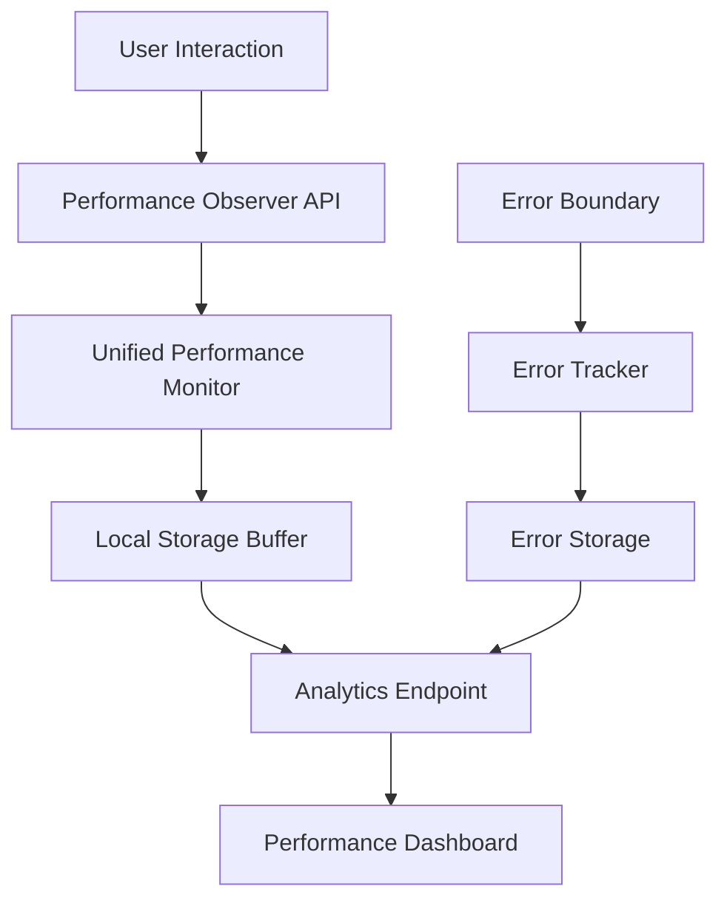

# Production Monitoring & Alerting Guide

## Overview
Comprehensive monitoring system for tracking application performance, errors, and user experience in production environments.

## Performance Monitoring Architecture

### Data Collection Pipeline


### Monitoring Components

#### 1. Unified Performance Monitor
**Location**: `src/lib/performance-monitor.ts`
**Purpose**: Single source of truth for all performance data collection

**Capabilities**:
- Real-time Web Vitals tracking (LCP, CLS, FID, TTFB, FCP)
- System metrics (memory, network, resources)
- Performance testing and validation
- Error tracking and categorization

#### 2. Production Optimizations
**Location**: `src/lib/production-optimizations.ts`  
**Purpose**: Environment-aware performance monitoring and optimization

**Features**:
- Memory usage monitoring with intelligent thresholds
- Bundle size analysis and warnings
- Global error handling and reporting
- Performance metrics aggregation

#### 3. Enhanced Performance Monitoring
**Location**: `src/lib/performance-enhanced.ts`
**Purpose**: Advanced monitoring with alerts and budget enforcement

**Advanced Features**:
- Performance budget enforcement
- Automated alerting system
- Resource performance analysis
- Error spike detection

## Key Performance Indicators (KPIs)

### Core Web Vitals
```typescript
const PERFORMANCE_BUDGETS = {
  lcp: { good: 2500, poor: 4000 },    // Largest Contentful Paint (ms)
  cls: { good: 0.1, poor: 0.25 },     // Cumulative Layout Shift
  fid: { good: 100, poor: 300 },      // First Input Delay (ms)  
  ttfb: { good: 800, poor: 1800 },    // Time to First Byte (ms)
  fcp: { good: 1800, poor: 3000 }     // First Contentful Paint (ms)
};
```

### System Health Metrics
- **Memory Usage**: Target <300MB, Alert >500MB
- **Error Rate**: Target <1%, Alert >5%
- **Load Time**: Target <3s, Alert >5s
- **Cache Hit Rate**: Target >80%, Alert <60%
- **Bundle Size**: Target <500KB JS, Alert >1MB

### Business Metrics
- **Conversion Rate**: Homepage to contact form
- **Engagement Rate**: Time spent on portfolio/services
- **Bounce Rate**: Single page sessions
- **User Journey Completion**: Quote request flow

## Alert Configuration

### Performance Alerts
```typescript
interface PerformanceAlert {
  type: 'performance' | 'error' | 'resource' | 'memory';
  severity: 'low' | 'medium' | 'high' | 'critical';
  threshold: number;
  message: string;
  action: 'log' | 'notify' | 'escalate';
}

const ALERT_CONFIG = {
  lcp: {
    type: 'performance',
    severity: 'high', 
    threshold: 4000,
    message: 'LCP exceeds 4s - user experience degraded',
    action: 'notify'
  },
  memory: {
    type: 'memory',
    severity: 'medium',
    threshold: 300,
    message: 'Memory usage high - potential leak detected', 
    action: 'log'
  },
  errors: {
    type: 'error',
    severity: 'critical',
    threshold: 5,
    message: 'Error rate spike detected',
    action: 'escalate'
  }
};
```

### Alert Channels
1. **Console Logging**: Development environment
2. **Local Storage**: Production error tracking
3. **Analytics Events**: Performance degradation
4. **External Monitoring**: Critical issues (future)

## Data Collection Strategy

### Client-Side Collection
```typescript
// Performance data structure
interface PerformanceMetrics {
  // Web Vitals
  lcp: number;
  cls: number; 
  fid: number;
  ttfb: number;
  fcp: number;
  
  // System metrics
  memoryUsage: number;
  resourceCount: number;
  bundleSize: number;
  
  // Context
  url: string;
  userAgent: string;
  timestamp: string;
  sessionId: string;
}
```

### Data Retention
- **Real-time Buffer**: 20 most recent entries in localStorage
- **Session Storage**: Current session metrics
- **Analytics**: Aggregated daily/weekly trends
- **Error Logs**: 100 most recent errors with stack traces

### Privacy Compliance
- No personal data collection
- Anonymous session identifiers only
- Opt-out capability via localStorage flag
- GDPR-compliant data handling

## Monitoring Dashboard

### Admin Dashboard Integration
**Location**: `src/pages/admin/Dashboard.tsx`

The admin dashboard includes performance monitoring through:
- Real-time performance metrics widget
- Historical performance trends
- Error tracking and analysis
- System health indicators

### Performance Widget
**Location**: `src/components/performance/UnifiedPerformanceMonitor.tsx`

Available in two modes:
1. **Widget Mode**: Floating bottom-right monitor for development
2. **Dashboard Mode**: Full-featured admin panel component

#### Widget Features
- Real-time Web Vitals display
- System resource monitoring
- Error count with details
- One-click data clearing
- Performance score calculation

## Production Deployment Monitoring

### Deployment Detection
```javascript
// Detect new deployments and clear stale cache
const DEPLOYMENT_MARKER = '/version.json';

async function detectDeployment() {
  try {
    const response = await fetch(DEPLOYMENT_MARKER);
    const data = await response.json();
    
    const storedVersion = localStorage.getItem('app_version');
    if (storedVersion && storedVersion !== data.version) {
      // New deployment detected - clear cache
      await clearAllCaches();
      logger.info('Cache cleared for new deployment', data);
    }
    
    localStorage.setItem('app_version', data.version);
  } catch (error) {
    logger.error('Deployment detection failed', error);
  }
}
```

### Version Tracking
**Location**: `public/version.json`
```json
{
  "version": "1.0.0",
  "buildTime": "2024-01-01T00:00:00Z",
  "commitHash": "abc123"
}
```

### Rollback Strategy
1. **Automatic Rollback**: If error rate >10% within 5 minutes
2. **Manual Rollback**: Admin dashboard emergency button
3. **Gradual Rollout**: Canary deployment monitoring
4. **Feature Flags**: Disable problematic features remotely

## Error Monitoring & Tracking

### Error Categories
1. **JavaScript Errors**: Runtime exceptions and syntax errors
2. **Network Errors**: API failures and connectivity issues
3. **Performance Errors**: Budget violations and slow responses
4. **User Experience Errors**: Layout shifts and loading issues

### Error Collection
```typescript
interface ErrorReport {
  type: 'javascript' | 'network' | 'performance' | 'user';
  message: string;
  stack?: string;
  url: string;
  line?: number;
  column?: number;
  userAgent: string;
  timestamp: string;
  sessionId: string;
  userId?: string;
}
```

### Error Processing Pipeline
1. **Collection**: Global error handlers capture all errors
2. **Filtering**: Remove noise and duplicate errors
3. **Enrichment**: Add context and user information
4. **Storage**: Local storage for immediate analysis
5. **Reporting**: Batch upload to analytics endpoint

## Performance Testing Integration

### Automated Lighthouse Audits
**Location**: `scripts/lighthouse-runner.js`

#### Test Configuration
```javascript
const AUDIT_ROUTES = [
  { path: '/', name: 'home', critical: true },
  { path: '/services', name: 'services', critical: true },
  { path: '/portfolio', name: 'portfolio', critical: false },
  { path: '/blog', name: 'blog', critical: false },
  { path: '/pricing', name: 'pricing', critical: true },
  { path: '/contact', name: 'contact', critical: true }
];

const PERFORMANCE_TARGETS = {
  desktop: { min: 90, target: 95 },
  mobile: { min: 80, target: 90 },
  accessibility: { min: 95, target: 100 },
  bestPractices: { min: 90, target: 95 },
  seo: { min: 95, target: 100 }
};
```

#### Continuous Integration
```yaml
# Example CI configuration
performance_audit:
  runs-on: ubuntu-latest
  steps:
    - name: Lighthouse CI
      run: |
        npm run build
        npm run preview &
        sleep 10
        npm run lighthouse:all
    - name: Performance Gate
      run: npm run performance:validate
```

### Performance Budgets
```javascript
const PERFORMANCE_BUDGETS = {
  resourceSizes: [
    { resourceType: 'script', budget: 500000 },      // 500KB JS
    { resourceType: 'stylesheet', budget: 100000 },  // 100KB CSS  
    { resourceType: 'image', budget: 1000000 },      // 1MB Images
    { resourceType: 'font', budget: 100000 }         // 100KB Fonts
  ],
  resourceCounts: [
    { resourceType: 'script', budget: 10 },
    { resourceType: 'stylesheet', budget: 5 },
    { resourceType: 'third-party', budget: 5 }
  ],
  timings: [
    { metric: 'first-contentful-paint', budget: 2000 },
    { metric: 'largest-contentful-paint', budget: 3000 },
    { metric: 'cumulative-layout-shift', budget: 0.1 }
  ]
};
```

## Monitoring Best Practices

### Data Collection
1. **Sampling**: Monitor 100% in development, 10% in production
2. **Batching**: Send data in batches to reduce network overhead
3. **Compression**: Compress large payloads before transmission
4. **Debouncing**: Avoid excessive data collection from rapid events

### Performance Impact
- **Monitoring Overhead**: <1% of total performance budget
- **Memory Footprint**: <10MB additional memory usage
- **Network Impact**: <1KB per page view for telemetry
- **CPU Usage**: Background processing only, no blocking operations

### Privacy & Security
- **Data Minimization**: Collect only necessary performance data
- **Anonymization**: No personal identifiers in telemetry
- **Encryption**: All data transmission over HTTPS
- **Retention**: Automatic data cleanup after 30 days

## Alerting & Response

### Alert Severity Levels
1. **Info**: Performance improvements or optimizations
2. **Warning**: Performance degradation, still functional
3. **Error**: Significant issues affecting user experience  
4. **Critical**: System failures requiring immediate attention

### Response Procedures
```typescript
const RESPONSE_PROCEDURES = {
  critical: {
    responseTime: '5 minutes',
    actions: ['page_team', 'rollback_ready', 'incident_channel'],
    escalation: ['engineering_lead', 'product_manager']
  },
  error: {
    responseTime: '15 minutes', 
    actions: ['investigate', 'monitor_trends', 'prepare_fix'],
    escalation: ['engineering_team']
  },
  warning: {
    responseTime: '1 hour',
    actions: ['log_issue', 'schedule_review'],
    escalation: ['none']
  }
};
```

### Incident Management
1. **Detection**: Automated monitoring triggers alert
2. **Triage**: Assess severity and impact scope
3. **Response**: Follow procedure for severity level
4. **Resolution**: Implement fix and verify metrics
5. **Post-Mortem**: Document lessons learned

---

*This monitoring system provides comprehensive visibility into application performance and user experience, enabling proactive optimization and rapid incident response.*